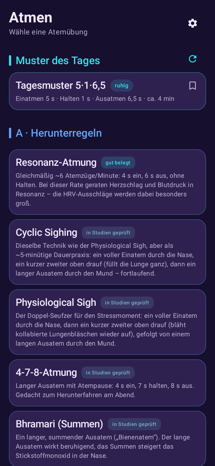
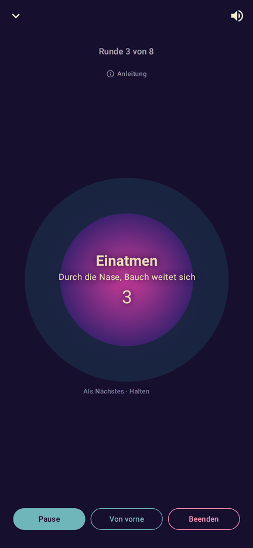
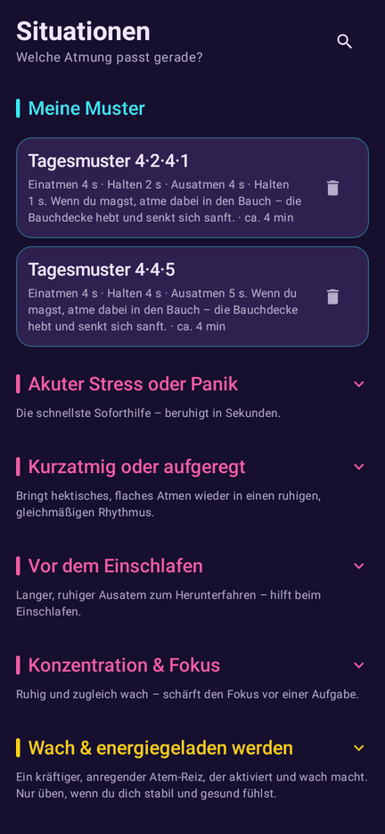
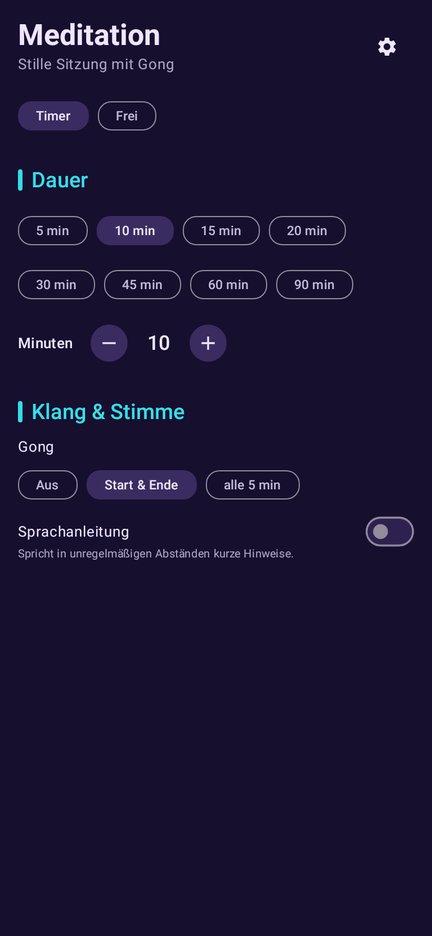
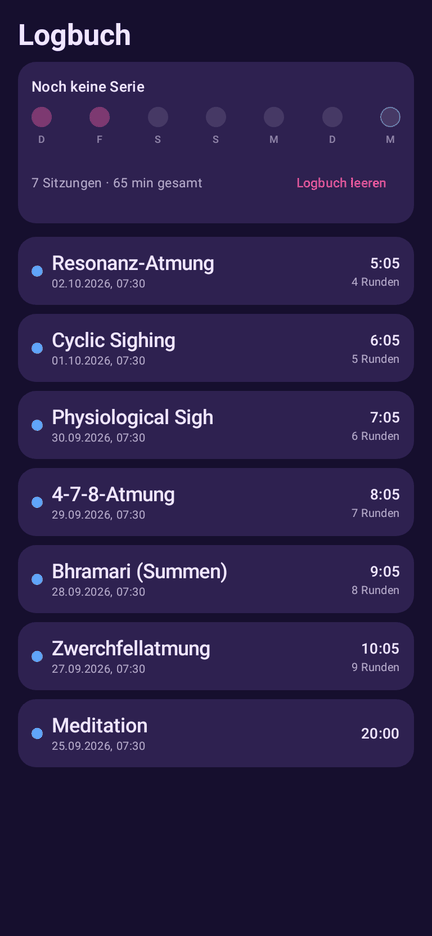

# Atemkraft

Android-App für Atemübungen und stille Meditation. Ein mitatmender Kreis, Töne und Vibration führen dich durch 16 Atemtechniken; zu jeder steht, was die Studienlage hergibt, mit Quellen und Sicherheitshinweisen. Dazu ein Meditations-Timer und ein Logbuch.

Ohne Konto, ohne Werbung, ohne Tracking. Die App läuft offline; Netz braucht sie nur, wenn du eine Sprachstimme lädst.

Atemkraft ist eine Wellness-App und kein Medizinprodukt. Sie ersetzt keinen Rat von Ärztin, Arzt oder anderem Fachpersonal.

<p>
  
  
  
  
  
</p>

**Inhalt:** [Funktionen](#funktionen) · [Installieren](#installieren) · [Datenschutz](#datenschutz) · [Rückmeldung](#rueckmeldung) · [Mitmachen](#mitmachen) · [Aus dem Quellcode bauen](#bauen) · [Projektstand](#projektstand) · [Lizenz](#lizenz)

<a id="funktionen"></a>
## Funktionen

Beschrieben ist der aktuelle Entwicklungsstand (`main`). Was die neueste Release-Version 1.5.1 noch nicht hat, ist mit *ab Version 1.6.0* markiert.

- **Atmen:** 16 Atemtechniken in vier Gruppen (Herunterregeln, Hochregeln, Balancieren, Funktionell), z. B. Resonanz-Atmung, 4-7-8, Box-Atmung, Lippenbremse. Jede Übung hat Anleitung, Einordnung der Studienlage, Sicherheitshinweise und Quellenangaben, in der Regel mit DOI oder PMID. Ein Etikett zeigt die Studienlage auf einen Blick: „gut belegt“ (Meta-Analyse oder mehrere unabhängige Studien), „in Studien geprüft“ (Studien gibt es, aber wenige, kleine oder nur in bestimmten Gruppen) oder „kaum untersucht“ (plausibel, aber kaum direkt erforscht). Bei getakteten Übungen lassen sich Ein-, Aus- und Halte-Zeiten anpassen; die Anpassung bleibt pro Übung gespeichert. Vor Wim Hof und Feueratmung erscheint ein Sicherheitshinweis, beim ersten Mal immer.
- **Sitzung:** Der Kreis wächst beim Einatmen und schrumpft beim Ausatmen. Wahlweise Wechseltöne oder ein durchgehender Ton, dazu Vibration bei jedem Phasenwechsel; alles abschaltbar. Eine laufende Sitzung lässt sich zu einer Leiste verkleinern.
- **Muster des Tages:** jeden Tag ein neues, zufällig erzeugtes Atemmuster, gleich für alle am selben Tag. Es bleibt in festen Grenzen (ruhige Muster: 8,5–13 s pro Atemzug, Ausatmen mindestens so lang wie Einatmen, Halten höchstens 4 s; sanft aktivierende: 6–9 s, Halten höchstens 2 s). Gedacht als Abwechslung, ohne Wirkversprechen. Muster lassen sich neu würfeln und speichern; gespeicherte stehen unter „Meine Muster“.
- **Situationen:** Einstiege nach Anlass, etwa „Vor dem Einschlafen“ oder „Konzentration & Fokus“, mit passenden Übungen. *Ab Version 1.6.0* mit Suche nach deinem Befinden („Wie fühlst du dich?“): Sie läuft ohne Netz und wird nicht gespeichert.
- **Meditation:** Timer (Schnellwahl 5–90 min, frei 1–120 min) oder offene Sitzung mit Stoppuhr. Gong aus, zu Start und Ende oder in festen Abständen. Optional eine gesprochene Anleitung: mit der Sprachausgabe deines Geräts oder mit einer ladbaren deutschen Stimme, die du vorher anhören kannst. Die Meditation läuft auch bei ausgeschaltetem Bildschirm weiter.
- **Logbuch:** abgeschlossene Sitzungen mit Wochenübersicht, Tagen in Folge und Minuten gesamt; lässt sich jederzeit leeren.
- **Begriffe erklärt:** ein Glossar für Fachwörter wie HRV oder Vagus.
- **Daten sichern** (*ab Version 1.6.0*): gespeicherte Muster als Datei exportieren und wieder importieren, an einen Ort deiner Wahl.

<a id="installieren"></a>
## Installieren

Atemkraft gibt es als APK-Datei auf GitHub, nicht im Play Store. Die App braucht Android 8.0 oder neuer.

1. Öffne auf dem Handy die Seite [Neueste Version](https://github.com/grenzenloseSchublade/atemkraft/releases/latest).
2. Tippe unter „Assets“ auf `atemkraft-vX.Y.Z.apk` (ca. 55 MB) und lade die Datei.
3. Öffne die geladene Datei. Android fragt beim ersten Mal, ob dein Browser (oder Dateimanager) Apps installieren darf. Tippe auf „Einstellungen“, erlaube es für diese eine App (der Schalter heißt je nach Hersteller etwa „Aus dieser Quelle zulassen“) und geh zurück.
4. Tippe auf „Installieren“. Google Play Protect kann bei Apps außerhalb des Play Store eine Warnung oder eine Prüfung anzeigen.
5. Wenn du magst, nimm die Erlaubnis aus Schritt 3 danach in den Einstellungen wieder zurück.

**Update:** die neue APK genauso über die alte installieren. Logbuch, Muster und Einstellungen bleiben erhalten. Automatische Update-Hinweise bekommst du z. B. mit [Obtainium](https://github.com/ImranR98/Obtainium), wenn du dort die Adresse dieses Repos einträgst.

### Echtheit prüfen

Jede offizielle APK ist mit demselben Zertifikat signiert. Sein SHA-256-Fingerabdruck:

```
75:02:2D:EF:E6:5A:A2:4E:22:3F:3E:79:88:0F:09:F4:23:45:67:57:00:2F:F0:B3:3B:A2:AE:29:B9:F4:18:90
```

- **Ohne Computer:** Die App [AppVerifier](https://github.com/soupslurpr/AppVerifier) zeigt den Fingerabdruck einer installierten App; vergleiche ihn für `app.atemkraft` mit dem Wert oben.
- **Am Computer:** `apksigner verify --print-certs atemkraft-vX.Y.Z.apk` (aus den Android Build-Tools) muss diesen Wert zeigen.
- Ab Version 1.4.1 steht die SHA-256-Prüfsumme der APK in den Release-Notes.

Eine APK mit anderem Zertifikat, etwa `CN=Android Debug`, ist kein offizielles Release. Einzelheiten: [docs/SECURITY.md](docs/SECURITY.md#echtheit-einer-apk-prüfen).

<a id="datenschutz"></a>
## Datenschutz

Atemkraft erhebt keine Daten über dich: kein Konto, kein eigener Server, keine Analyse, keine Werbung, keine Absturzberichte, keine Google Play Services. Logbuch, Muster und Einstellungen bleiben auf deinem Gerät.

- **Einzige Netzverbindung:** Tippst du in den Einstellungen bei einer Stimme auf „Laden“, holt die App das Stimm-Archiv von GitHub (Projekt [sherpa-onnx](https://github.com/k2-fsa/sherpa-onnx)) und prüft es gegen eine fest hinterlegte Prüfsumme. Danach läuft auch die Sprachausgabe offline. GitHub sieht dabei u. a. deine IP-Adresse.
- **Keine Cloud:** Die App ist vom Android-Cloud-Backup ausgeschlossen. Beim Handywechsel kann ab Android 12 die direkte Übertragung (Kabel oder WLAN-Direkt) die Daten mitnehmen; ob sie das tut, hängt laut Android-Dokumentation vom Gerätehersteller ab. Sicher mitnehmen lassen sich gespeicherte Muster per Export (*ab Version 1.6.0*). **Version 1.5.1** erlaubt das Android-Backup noch; ist es auf deinem Gerät eingeschaltet, kann Android die App-Daten in dein Backup-Konto (meist Google) sichern.

Alle Einzelheiten, auch was bis Version 1.5.1 anders ist: [Datenschutzerklärung](docs/PRIVACY.md).

### Berechtigungen

| Berechtigung | Wofür |
|---|---|
| `INTERNET` | nur das Laden einer Stimme |
| `VIBRATE` | fühlbare Phasenwechsel und ein kurzer Tick beim Antippen des Kreises; mit dem Schalter „Vibration“ abschaltbar, den Tick erst ab Version 1.6.0 |
| `WAKE_LOCK` | hält den Prozessor während einer Meditation wach, damit Gongs pünktlich kommen |
| `FOREGROUND_SERVICE`, `FOREGROUND_SERVICE_MEDIA_PLAYBACK` | Meditation läuft bei ausgeschaltetem Bildschirm weiter |
| `POST_NOTIFICATIONS` | Benachrichtigung „Meditation läuft“ mit „Beenden“; ohne sie läuft der Timer trotzdem |

<a id="rueckmeldung"></a>
## Rückmeldung

Fehler gefunden oder eine Idee? Eröffne ein [Issue](https://github.com/grenzenloseSchublade/atemkraft/issues/new/choose) mit der Vorlage „Fehler melden“ oder „Idee vorschlagen“. Die Vorlagen fragen nach Gerät, Android-Version und App-Version (Einstellungen → „Über Atemkraft“).

Issues sind öffentlich: Bitte keine Gesundheitsdaten eintragen. Sicherheitslücken bitte vertraulich melden, siehe [docs/SECURITY.md](docs/SECURITY.md#melden).

<a id="mitmachen"></a>
## Mitmachen

Beiträge sind willkommen, vom Tippfehler bis zur neuen Übung. Wie du baust, prüfst und einreichst, steht in [CONTRIBUTING.md](CONTRIBUTING.md). Es gilt der [Verhaltenskodex](CODE_OF_CONDUCT.md).

Die Regeln für Design, Text und Code stehen im [Styleguide](docs/STYLEGUIDE.md), die für Sicherheit und Datenschutz in [docs/SECURITY.md](docs/SECURITY.md).

<a id="bauen"></a>
## Aus dem Quellcode bauen

Voraussetzungen: JDK 17, Android SDK mit Plattform 36 (Pfad in `local.properties` oder `ANDROID_HOME`), Python 3 für die Stil-Checks.

```bash
git clone https://github.com/grenzenloseSchublade/atemkraft.git
cd atemkraft
scripts/build.sh installDebug    # Debug-APK bauen und installieren
scripts/check.sh                 # alle Prüfungen wie im CI
```

Eine Release-APK ohne eigenen Schlüssel ist unsigniert (so erwartet es z. B. F-Droid, das selbst signiert); eine selbst gebaute APK lässt sich nicht über die offizielle installieren, weil die Signatur abweicht.

Toolchain: Gradle 8.11.1, Android Gradle Plugin 8.9.1, Kotlin 2.1.0, Jetpack Compose (BOM 2025.01.00) mit Material 3, compileSdk und targetSdk 36, minSdk 26.

```
domain/   reines Modell: Phase, Segment, Exercise, Zeitplan, Muster-Generator, Befindens-Suche
data/     Übungen, Situationen und Quellen (Refs.kt), Room (Logbuch, Muster), DataStore (Einstellungen)
cue/      Töne, Gong, Vibration, Sprachausgabe (System oder Piper-Stimmen über sherpa-onnx)
ui/       theme/, components/ und je Screen ein Paket
```

<a id="projektstand"></a>
## Projektstand

- **Neueste Version:** [1.5.1](https://github.com/grenzenloseSchublade/atemkraft/releases/latest). Seitdem auf `main`: Befindens-Suche, Export und Import der Muster, kein Cloud-Backup mehr, die Stimme GLaDOS entfernt (keine Lizenz), Feinschliff an Schrift und Bedienelementen sowie viele kleine Korrekturen.
- **Verteilung:** GitHub-Releases. Wegen der vorkompilierten sherpa-onnx-Bibliothek (`app/libs/*.aar`) passt die App nicht ins Haupt-Repo von F-Droid, das alles aus dem Quellcode baut; IzzyOnDroid wäre ein passender Kanal.
- **Ideen:** eigene Übungen per Editor, Wear OS, Widgets. Eine eigene Stimme für die Meditationsanleitung: Anleitung in [docs/VOICE_CLONING.md](docs/VOICE_CLONING.md).
- **iOS:** Recherche und Plan, noch nicht umgesetzt: [docs/IOS_PLAN.md](docs/IOS_PLAN.md).

<a id="lizenz"></a>
## Lizenz

Der Quellcode von Atemkraft steht unter der [MIT-Lizenz](LICENSE): frei wiederverwendbar, auch kommerziell, solange der Copyright-Hinweis erhalten bleibt.

Die verteilte APK enthält zusätzlich Bausteine unter Apache-2.0, MIT, BSD-2-Clause, BSD-3-Clause, MPL-2.0, Unlicense und der Unicode-Lizenz sowie **eSpeak NG unter GPL-3.0-or-later** (statisch in der sherpa-onnx-Bibliothek). Nach Auffassung der FSF gilt deshalb für die Weitergabe der APK als Ganzes die GPL-3.0: Lizenztexte beilegen (liegen in der APK unter `assets/licenses/`) und den Quellcode zugänglich machen (dieses Repo plus sherpa-onnx v1.13.6 mit den dort gepinnten Bibliotheken).

Die Stimmen sind nicht in der APK; die App lädt sie auf Wunsch, jede mit eigener Lizenz. Einige sind nur für nicht kommerzielle Nutzung freigegeben; die App kennzeichnet sie mit „nur nicht kommerziell“. Vollständige Liste mit Versionen, Rechteinhabern und Belegen: [THIRD_PARTY_LICENSES.md](THIRD_PARTY_LICENSES.md); in der App unter *Über Atemkraft → Lizenzen*. Keine Rechtsberatung.
